# Exercice en video


Voir enoncer video, ici:
[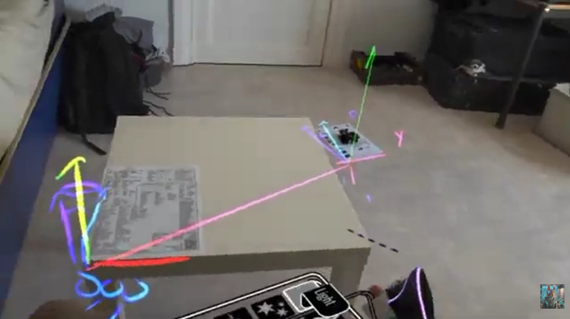](https://youtu.be/JzbzqD78Xyg?t=249)  
- Savoir charger un object 3D sur une feuille A4.  
- Savoir charger un object 3d autour de votre ecran a partir de la table
- Savoir charger un niveau a partir de deux points eloigners sur le sol de la piece.


--------------

Creeons un projet de quarantaine.
Un projet non XR non gitter
Q_HelloUnityA4


-------------------

[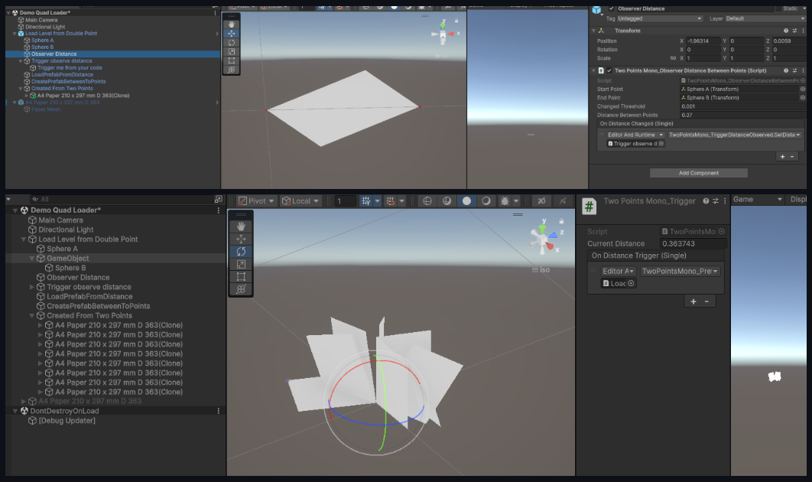](https://github.com/EloiStree/2025_06_05_upm_two_points_quad_loader)   
https://github.com/EloiStree/2025_06_05_upm_two_points_quad_loader   

Mon ancien code sur le sujet:
https://github.com/EloiStree/2025_06_05_upm_two_points_quad_loader   

Mon future code Godot sur le sujet:  
https://github.com/EloiStree/2025_06_05_gdp_two_points_quad_loader  
(Car je vais devoir le recoder en Godot par la suite)  


Meme concept mais avec plus de rotations et des triangles:  
[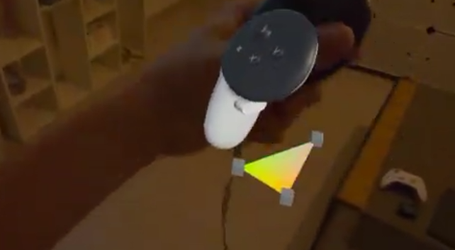](https://youtu.be/0k1kqoNi4UM?t=36)    
[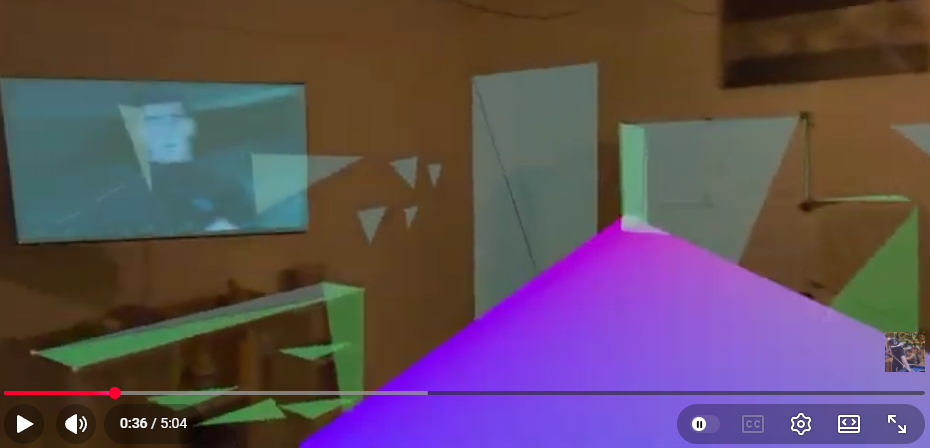](https://youtu.be/0k1kqoNi4UM?t=36)  
https://youtu.be/0k1kqoNi4UM?t=36   


-----------------------


# Repartons de Zero.


Vous pouvez aurez besoin de ceci: [Download](direction_gizmo.obj)   
[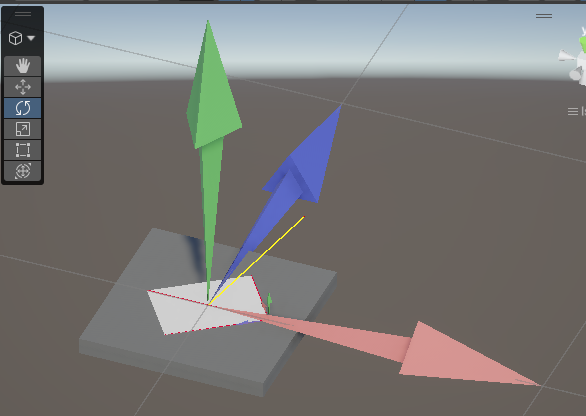](direction_gizmo.obj)     


```cs
using UnityEngine;

namespace Eloi.TwoPoints {
    /// <summary>
    /// I am a class that store the position of two transform in the scene.
    /// It is use to find what to load based on distance and where to load from the two points
    /// </summary>
    [ExecuteInEditMode]
    public class TwoPointsMono_DistanceBetweenTwoPoints : MonoBehaviour {
        public Transform m_pointA;
        public Transform m_pointB;
        public float m_distance;
        public bool m_useDebugDraw = true;
        public Color m_debugDrawColor = Color.yellow;
        private void Reset()
        {
            
            int childCount = transform.childCount;
            if (childCount >0)
            {
                m_pointA = transform.GetChild(0);
            }
            if (childCount > 1)
            {
                m_pointB = transform.GetChild(1);
            }

        }
        public float GetDistance()
        {
            if (m_pointA == null || m_pointB == null)
            {
                return 0f;
            }
            return Vector3.Distance(m_pointA.position, m_pointB.position);
        }
        private void Update()
        {
            if (m_pointA == null || m_pointB == null)
            {
                return;
            }
            m_distance = GetDistance();
            if (m_useDebugDraw)
            {
                Debug.DrawLine(m_pointA.position, m_pointB.position, m_debugDrawColor);
            }
        }
    }
}
```

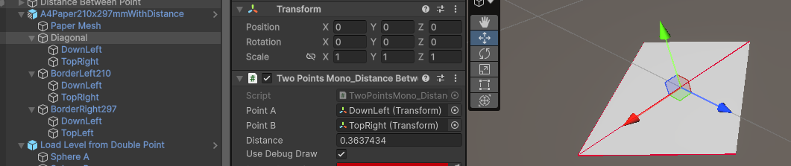
Une feuille A4 fait  210 x 297 mm
Si l'on place le deux points au extremiter.
Cela donne 0.3637444 ( h =sqrt(210*210+297*297) )


Considerons notre feulle avec un coin en bas a gauche.
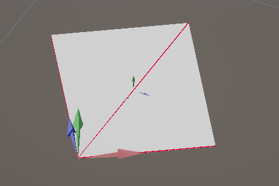


-------------------


**Exercice:**   
[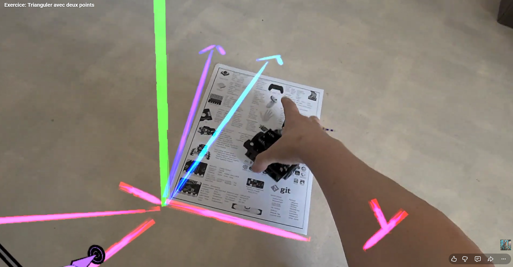](https://youtu.be/JzbzqD78Xyg?t=236)     
[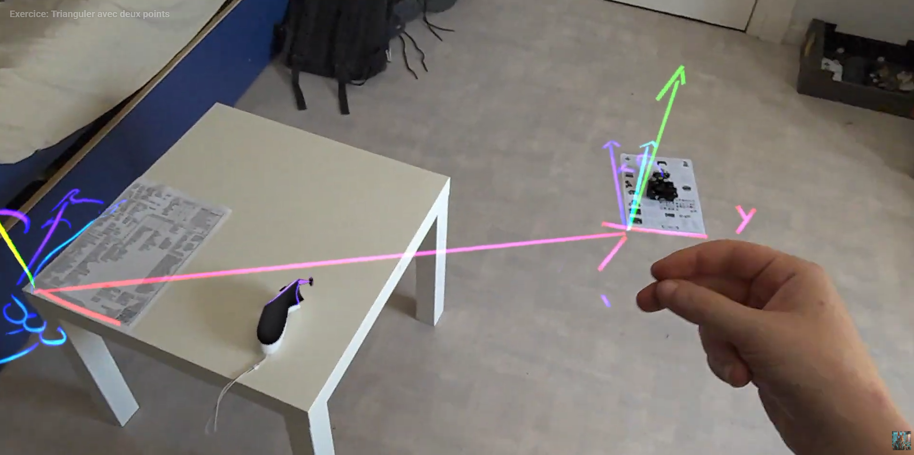](https://youtu.be/JzbzqD78Xyg?t=236)     
https://www.youtube.com/watch?v=JzbzqD78Xyg&t=18s      
  
**Solution:**  
[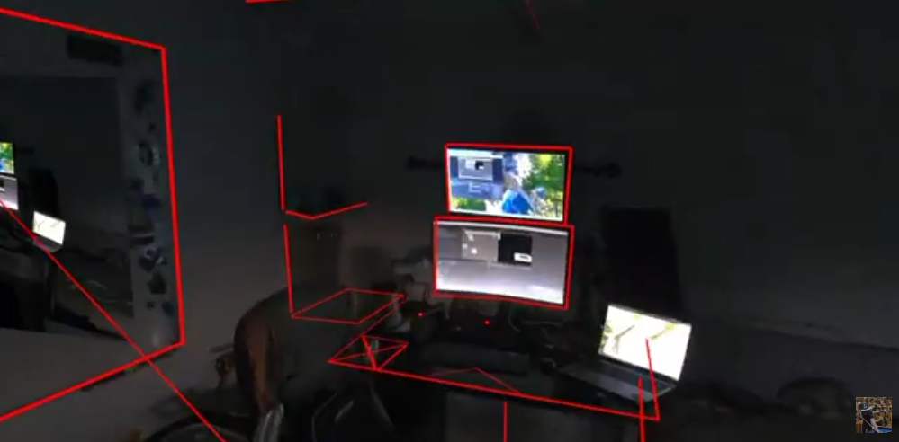](https://youtu.be/5VOHJKlRwCE?t=28)     
[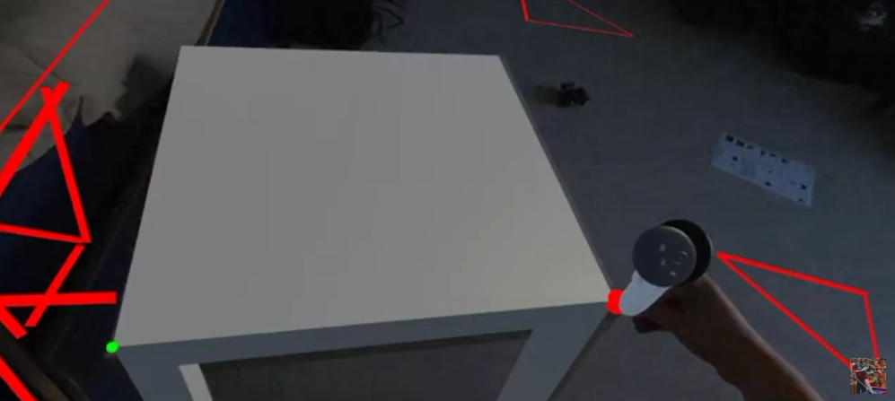](https://youtu.be/5VOHJKlRwCE?t=140)   
https://youtu.be/5VOHJKlRwCE?t=28   


**Git code:**      
https://github.com/EloiStree/2026_06_07_upm_load_prefab_from_two_points   

```
    "be.elab.twopointsloader": "https://github.com/EloiStree/2026_06_07_upm_load_prefab_from_two_points.git",
```
   